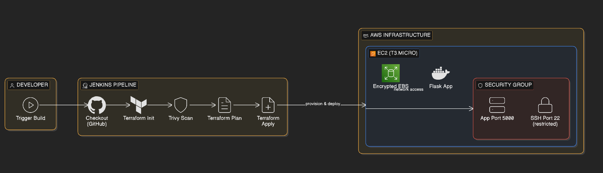
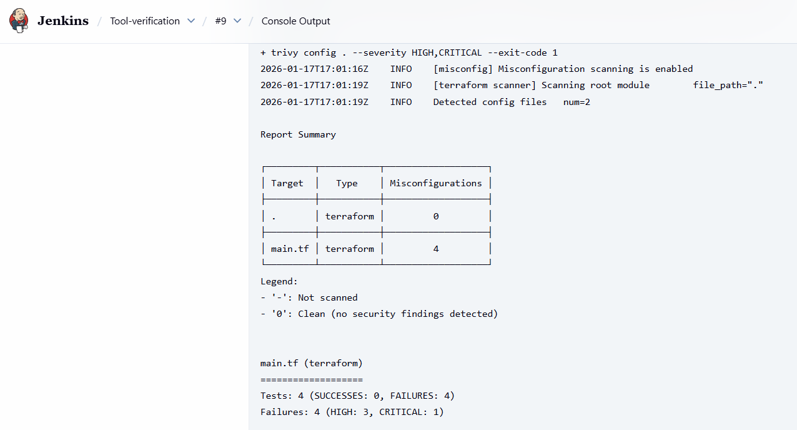
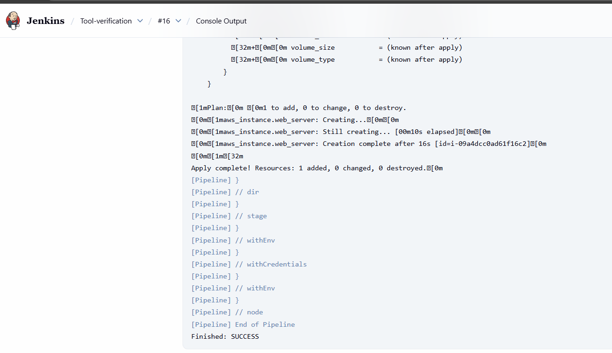
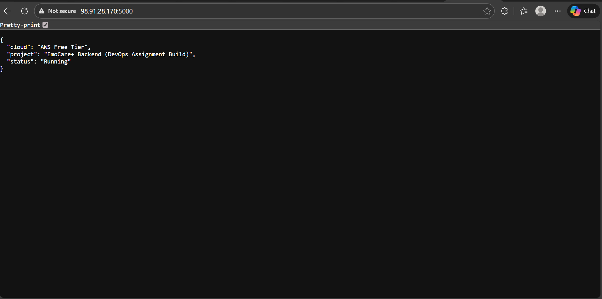

# EmoCare+ DevOps Pipeline Assignment

## Project Overview

### Architecture Explanation
### Diagram

This project deploys a secure, containerized Python Flask application to the AWS Cloud.
* **Infrastructure as Code (IaC):** Terraform provisions the infrastructure, ensuring reproducible and version-controlled environments.
* **CI/CD Pipeline:** Jenkins orchestrates the workflow, handling source code checkout, security scanning, infrastructure planning, and deployment.
* **Security:** Trivy scans the infrastructure code for misconfigurations (e.g., open ports, unencrypted volumes) before deployment.
* **Containerization:** The application runs inside a Docker container, ensuring consistency across environments.

### Cloud Provider Used
* **AWS (Amazon Web Services)**
* **Region:** us-east-1 (N. Virginia)
* **Resources:** EC2 Instance (t3.micro), Security Groups, Elastic Block Store (EBS).

### Tools and Technologies
* **Terraform:** Infrastructure Provisioning.
* **Jenkins:** CI/CD Automation.
* **Trivy:** Security & Vulnerability Scanning.
* **Docker:** Application Containerization.
* **Python (Flask):** Backend Application.
* **GitHub:** Version Control.

---

## Before & After Security Report

### 1. Initial Failing Jenkins Scan
*The pipeline initially failed due to critical security risks identified by Trivy (e.g., SSH open to the world).*

### 2. Final Passing Jenkins Scan
*After applying AI-recommended remediation, the security scan passed, and the pipeline turned green.*

---

## AI Usage Log 

### The Exact AI Prompt Used
> "I have a Terraform security report with the following errors: AVD-AWS-0107 (SSH open to world), AVD-AWS-0104 (Unrestricted egress), AVD-AWS-0028 (IMDS tokens not required), and AVD-AWS-0131 (Unencrypted root block). Please rewrite my main.tf to fix these security issues."

### Summary of Identified Risks
The AI analysis highlighted high-severity risks in the initial code:
1.  **Unrestricted SSH Access:** Port 22 was open to `0.0.0.0/0`, allowing anyone on the internet to attempt brute-force logins.
2.  **Unencrypted Data:** The root volume was unencrypted, posing a data leakage risk if drives were compromised.
3.  **IMDSv1 Vulnerability:** The instance metadata service did not require tokens, leaving the server vulnerable to Server-Side Request Forgery (SSRF) attacks.

### How the AI-Recommended Changes Improved Security
The generated code fixed these issues by:
* **Restricting Network Access:** Changed SSH ingress from `0.0.0.0/0` to a private/restricted IP range (`10.0.0.0/8`).
* **Enforcing Encryption:** Added `encrypted = true` to the `root_block_device` block.
* **Hardening Metadata:** Enforced IMDSv2 by setting `http_tokens = "required"`, neutralizing SSRF vectors.
* **Operational Stability:** Suggested switching to `t3.micro` to ensure Free Tier compatibility while applying these security features.

---

## Application Verification
*The application is successfully running on the AWS Public IP.*

### Video Recording
**[Link to Video Recording Here]**
*(Click the link above to view the 5-10 minute demonstration of the pipeline execution and deployment.)*